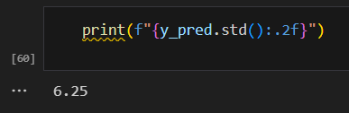
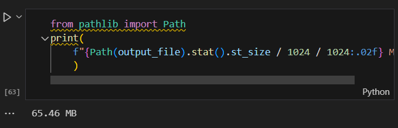
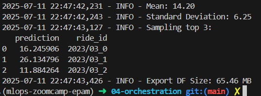
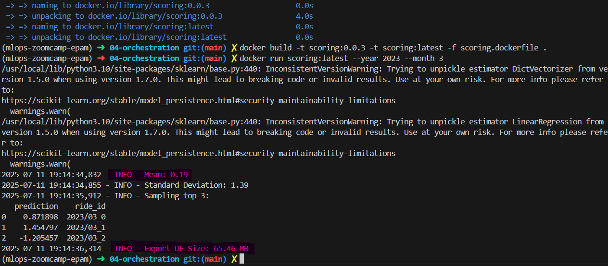

# Q1. Notebook
**What's the standard deviation of the predicted duration for this dataset?**
Source: [scoring.ipynb](scoring.ipynb)

`6.25`

# Q2. Preparing the output
**What's the size of the output file?**

Source: [scoring.ipynb](scoring.ipynb)

`65.46`

# Q3. Creating the scoring script
**Which command you need to execute for that?**

`python scoring.py --year 2023 --month 3`
# Q4. Virtual environment
**What's the first hash for the Scikit-Learn dependency?**

Note: UV is used instead of pipenv. Scikit-Learn version is 1.7.0 (see [uv.lock](../uv.lock))

`sha256:c01e869b15aec88e2cdb73d27f15bdbe03bce8e2fb43afbe77c45d399e73a5a3`

# Q5. Parametrize the script
**What's the mean predicted duration?**

Source: [scoring.dockerfile](scoring.dockerfile)

`14.20`

# Q6. Docker container
**Now run the script with docker. What's the mean predicted duration for May 2023?**

Source: [scoring.dockerfile](scoring.dockerfile)

`0.19`

