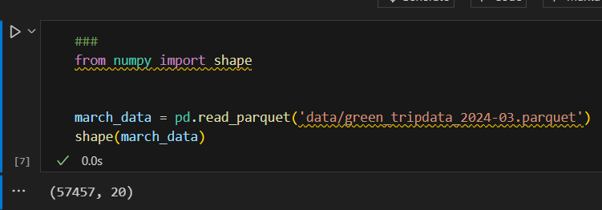
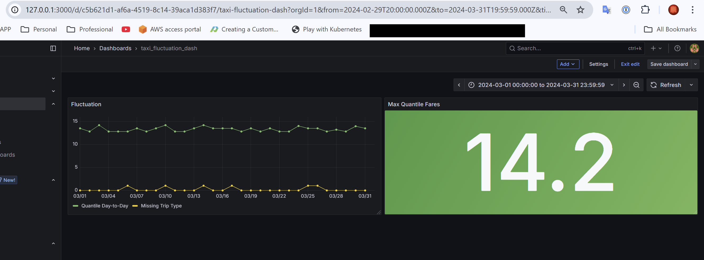

# Q1. Prepare the dataset
**What is the shape of the downloaded data? How many rows are there?**

Source: [baseline_model_nyc_taxi_data.ipynb](baseline_model_nyc_taxi_data.ipynb)

`57457`

# Q2. Metric
**What metric did you choose?**

Source: [metrics_batch.py](metrics_batch.py)

`ColumnMissingValuesMetric`

# Q3. Monitoring
**What is the maximum value of metric quantile = 0.5 on the "fare_amount" column during March 2024 (calculated daily)?**

`14.2`

# Q4. Dashboard
**Where to place a dashboard config file?**

`project_folder/dashboards` (05-monitoring/dashboards)

We put it in the `./dashboards` so that it loads into Grafana since we mapped the volume.