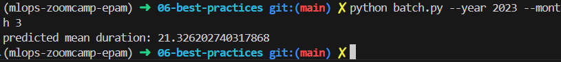
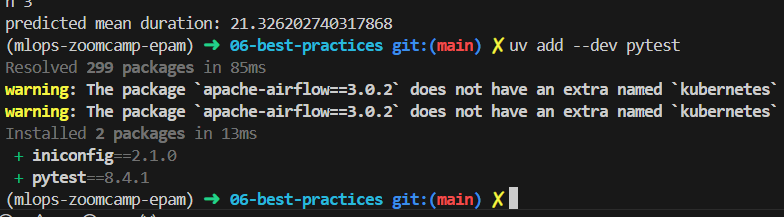
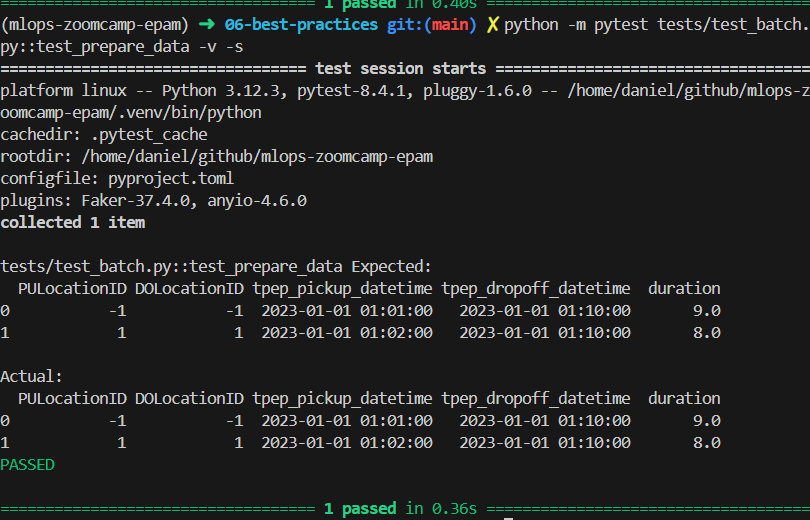
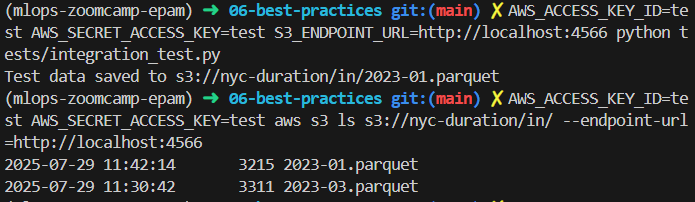
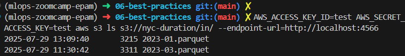
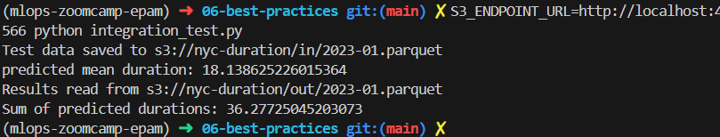

# Q1. Prepare the dataset
Source: [06-best-practices/batch.py](batch.py)

# Q2. Installing pytest
Source: [../pyproject.toml](../pyproject.toml)

**What should be the other file?**

`__init__.py`

# Q3. Writing first unit test
**How many rows should be there in the expected dataframe?**

Source: [06-best-practices/tests/test_batch.py](tests/test_batch.py)

`2`

# Q4. Mocking S3 with Localstack
**In both cases we should adjust commands for localstack. What option do we need to use for such purposes?**

> [!NOTE]  
> During testing my existing AWS SSO configuration was interfereing with LocalStack, I fixed it later, but in screenshot you can see me using mock env vars in terminal.

`--endpoint-url`

# Q5. Creating test data
**What's the size of the file?**

Source: [06-best-practices/integration_test.py](integration_test.py)

`3215` - closest answer is `3620`

# Q6. Finish the integration test
**What's the sum of predicted durations for the test dataframe?**

Source: [06-best-practices/integration_test.py](integration_test.py)

`36.28`

